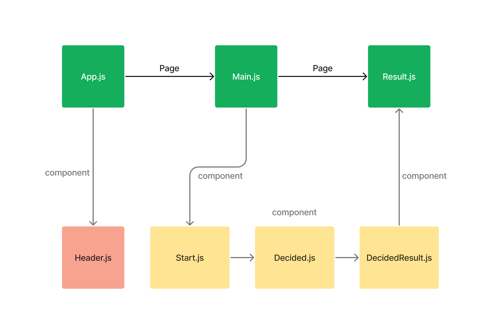

 

## **Project. What eat today**
>**[코드스테이츠 FE 45기] 스터디_참숯가마**  
>**개발기간 : 2023.7.17 ~ 2023.08.5**

 

## 프로젝트팀 소개
|
윤 예빈
|
송 지훈
|
|---|---|
|||
|
[@YebinYun](https://github.com/YebinYun)
|
[@tedhun21](https://github.com/tedhun21)
|
 

## 프로젝트 소개

## 주요 기능
### 추천 받고 싶은 메뉴를 보기를 통해 고르도록 구현
- ⚡원하는 항목을 보기를 통해 클릭하여 메뉴선택 가능
- ⚡여러가지 메뉴를 보여줌

### 사용자에 위치를 받아와 추천 받은 식당 추천
- ⚡최종 선택된 음식을 기준으로 식당 추천
- ⚡추천 받은 음식을 사용자에 위치를 기반으로 주변 식당 안내

### 상단에 오늘의 날씨와 시간 제공
- ⚡시간에 따라 음식을 참고 가능하도록 구현
- ⚡또한, 날씨에 따라 음식을 참고 가능하도록 구현

 

## **Stack**
### **Environment**
  

### **Config**

### **Development**
     

 

## 아키텍쳐
### 디렉토리 구조
